# 📊 Diagramas para Publicação no LinkedIn

## 🎨 Como Usar

Você pode converter estes diagramas Mermaid em imagens usando:
- https://mermaid.live (online, gratuito)
- Extensão VS Code "Markdown Preview Mermaid Support"
- https://kroki.io (API para converter)

---

## 1. Stack Tecnológica (Para Thumbnail/Capa)

```mermaid
graph TB
    subgraph "Frontend"
        A[Next.js 19]
        B[React 19]
        C[Tailwind CSS]
        D[shadcn/ui]
    end
    
    subgraph "Backend"
        E[Fastify 5]
        F[Prisma 7]
        G[JWT Auth]
        H[Swagger]
    end
    
    subgraph "Infraestrutura"
        I[PostgreSQL]
        J[Nginx]
        K[Ubuntu VPS]
        L[GitHub Actions]
    end
    
    subgraph "Ferramentas"
        M[TypeScript]
        N[TurboRepo]
        O[CASL RBAC]
        P[Zod]
    end
    
    A --> E
    E --> F
    F --> I
    L --> K
    
    style A fill:#0070f3
    style B fill:#61dafb
    style E fill:#000000
    style F fill:#2d3748
    style I fill:#336791
    style M fill:#3178c6
```

---

## 2. Arquitetura do Sistema (Visão Geral) - ATUALIZADO

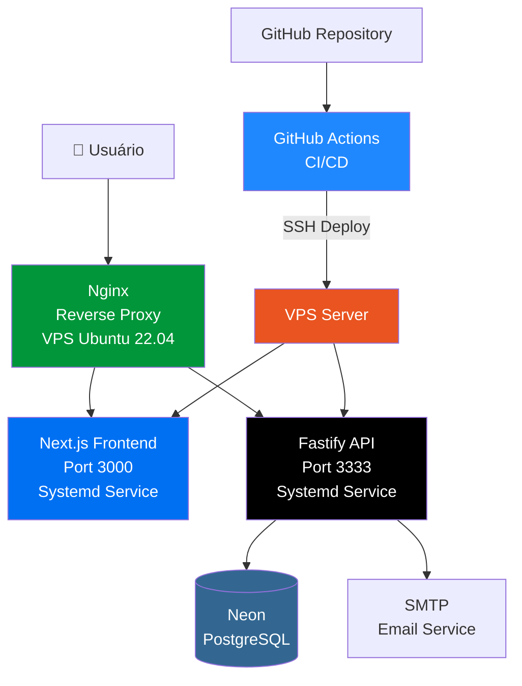

---

## 2b. Arquitetura de Deploy (Detalhada) - NOVO

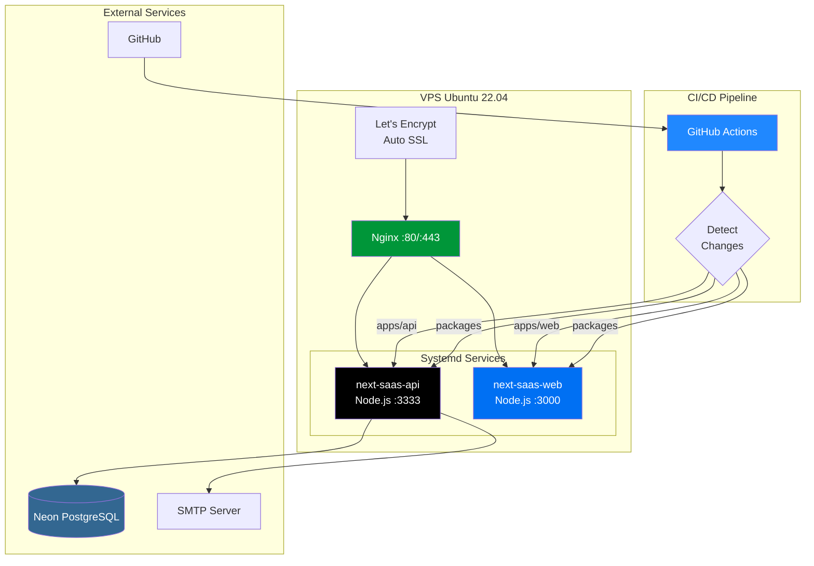

---

## 3. Fluxo RBAC Simplificado

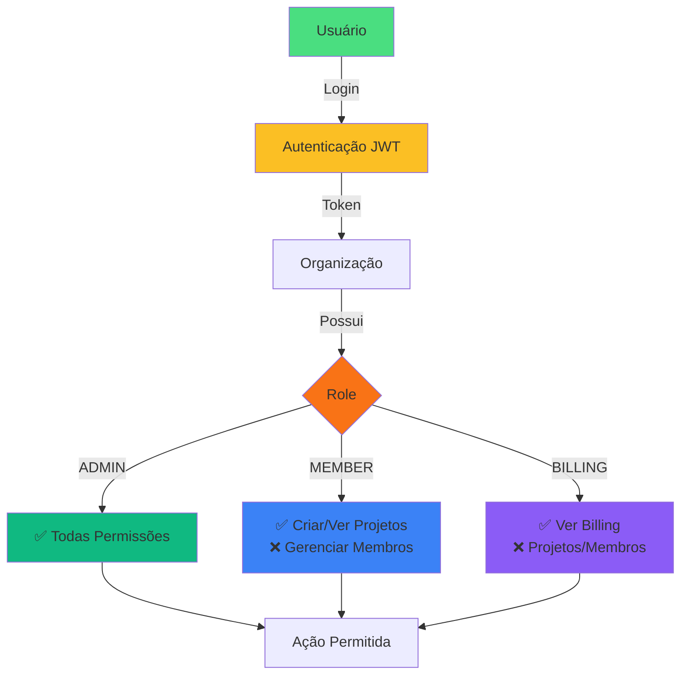

---

## 4. Fluxo de Convite por Email

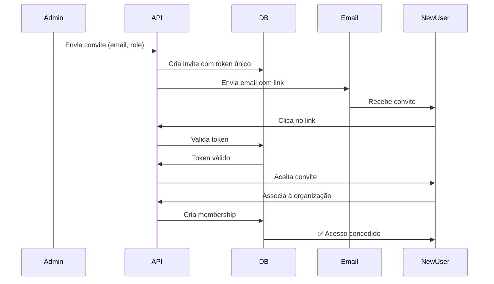

---

## 5. Pipeline CI/CD (Inteligente) - ATUALIZADO

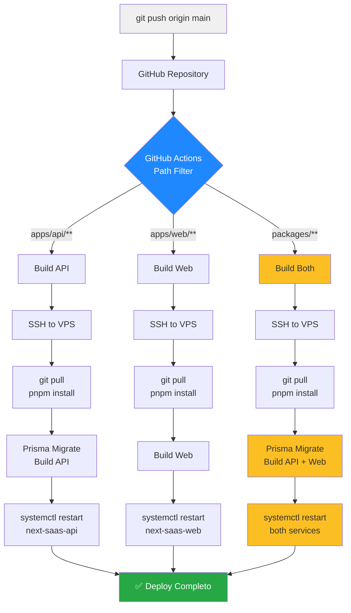

---

## 5b. Fluxo de Deploy Otimizado - NOVO

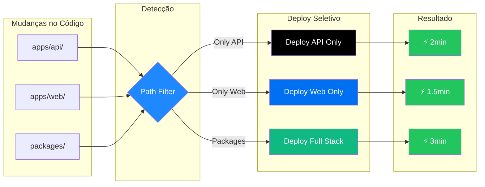

---

## 6. Estrutura Multi-Tenant

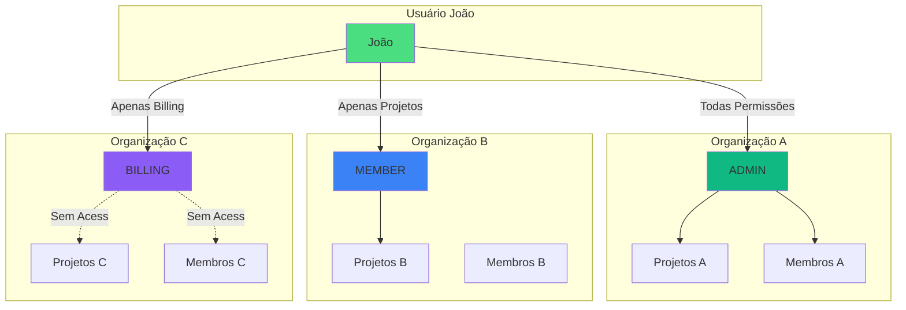

---

## 7. Autenticação e Autorização

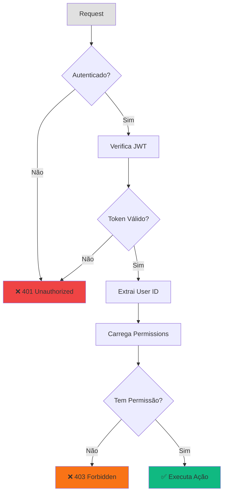

---

## 8. Monorepo Structure

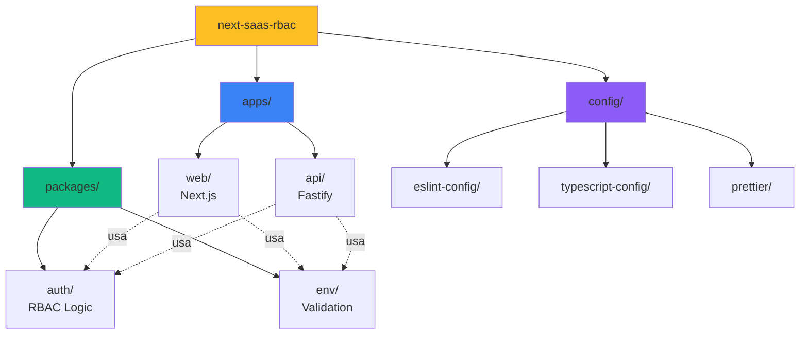

---

## 9. Features Principais (Visual Atrativo)

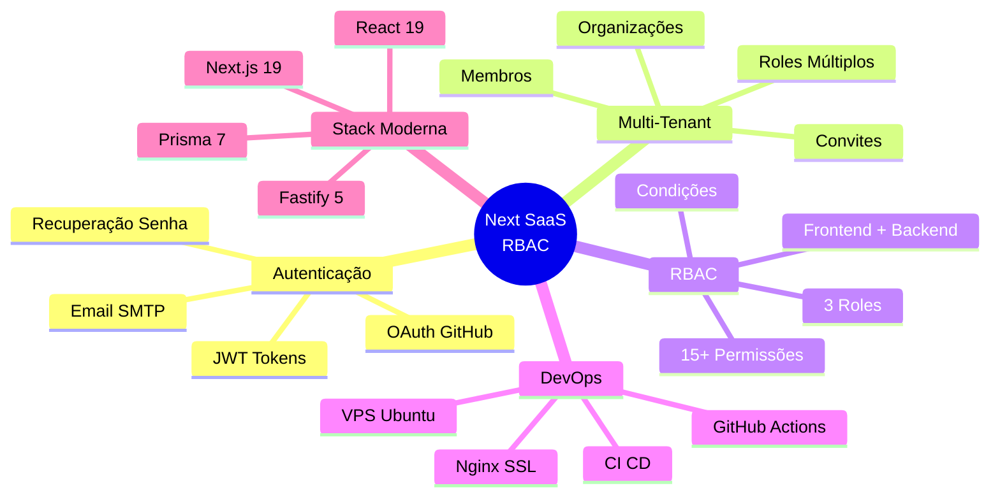

---

## 10. Evolução da Arquitetura de Deploy - ATUALIZADO

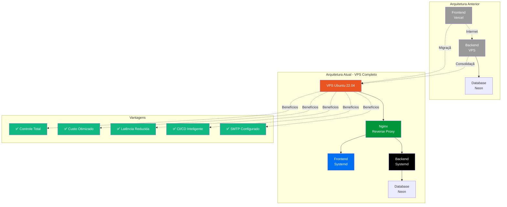

---

## 11. Stack de Infraestrutura Completa - NOVO

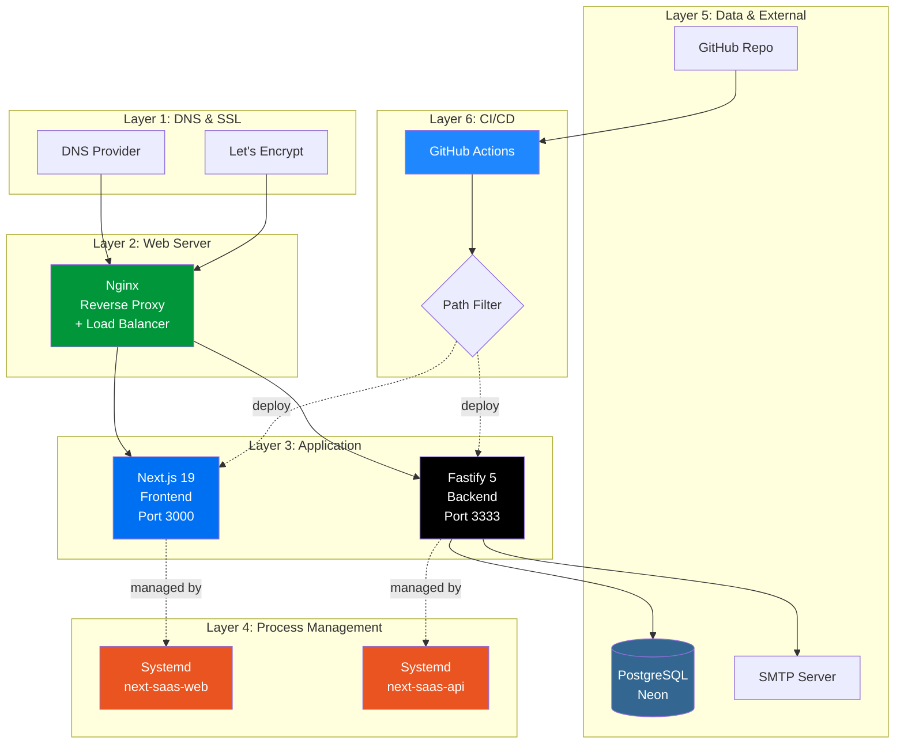

---

## 💡 Dicas para Criar Imagens Profissionais

### Opção 1: Converter Mermaid para PNG
1. Acesse https://mermaid.live
2. Cole o código do diagrama
3. Ajuste cores e estilo
4. Exporte como PNG (alta resolução)

### Opção 2: Screenshot do VS Code
1. Abra o arquivo README.md
2. Use extensão "Markdown Preview Mermaid Support"
3. Tire screenshot limpo (Ctrl+Shift+P → "Screenshot")
4. Edite no Figma/Canva para adicionar bordas

### Opção 3: Criar Thumbnail Customizado
Use Canva ou Figma:
- Fundo gradiente (azul → roxo)
- Logos das tecnologias principais
- Título grande "Next.js SaaS RBAC"
- Subtítulo com principais features
- Seu nome/foto no canto

### Opção 4: Carrossel de 5 Imagens
1. **Capa:** Logo + stack tecnológica
2. **Arquitetura:** Diagrama 2 (sistema completo)
3. **RBAC:** Diagrama 3 (fluxo de permissões)
4. **CI/CD:** Diagrama 5 (pipeline)
5. **Código:** Screenshot de código TypeScript com highlight

---

## 🎨 Paleta de Cores Sugerida

Para manter consistência visual:

```
Next.js:     #0070f3
React:       #61dafb
TypeScript:  #3178c6
Node.js:     #339933
PostgreSQL:  #336791
Fastify:     #000000
Vercel:      #000000
Success:     #10b981
Warning:     #f59e0b
Error:       #ef4444
```

---

## 📱 Formato Ideal para LinkedIn

- **Imagem única:** 1200x627px (ratio 1.91:1)
- **Carrossel:** 1080x1080px por imagem (quadrado)
- **Vídeo:** 1920x1080px, máximo 10 minutos
- **Arquivo:** PNG para qualidade, JPG para tamanho menor

---

## 🚀 Ferramentas Úteis

- **Mermaid Live:** https://mermaid.live
- **Excalidraw:** https://excalidraw.com (diagramas manuais)
- **Canva:** https://canva.com (design profissional)
- **Carbon:** https://carbon.now.sh (screenshots de código)
- **Figma:** https://figma.com (design avançado)

---

**Escolha 1-2 diagramas principais e converta para imagens profissionais!**

Os mais impactantes para LinkedIn são:
1. Diagrama 2 (Arquitetura)
2. Diagrama 3 (RBAC)
3. Diagrama 5 (CI/CD)
